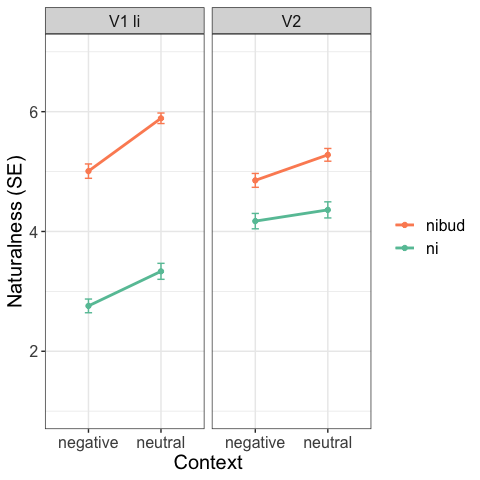
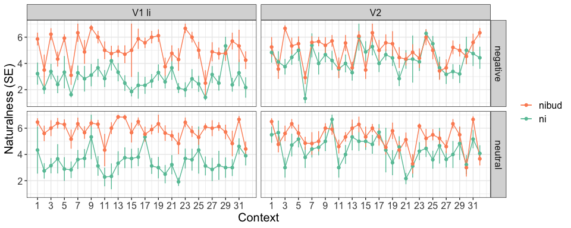

R Notebook for naturalness/acceptability judgment experiments
================
Masha Onoeva
(May 2024)

- [Info](#info)
- [Loading data](#loading-data)
- [Fillers and unreliable
  participants](#fillers-and-unreliable-participants)
- [Data sets](#data-sets)
- [Experiment 1](#experiment-1)
  - [Descriptive stat](#descriptive-stat)
  - [Inferential stat](#inferential-stat)
- [Experiment 2 (for later)](#experiment-2-for-later)

## Info

Hi! This R notebook describes the steps that are required for the
analysis of naturalness/acceptability judgment linguistic experiments. I
use the experiment that I did with Radek Šimík testing Russian negated
polar questions in different contexts as the example data (see [Onoeva
and Šimík
2023](https://mariaonoeva.github.io/assets/pdf/FDSL16_RuNPQs_Onoeva_Simik.pdf)).
The experiment was run on [LRex](https://www.l-rex.de/), so your raw
data can be different if you use a different platform. We had several
sub-experiments, here I report on two because code is the same for all
of them.

#### Design

#### Files

The csv file with raw results is available in this repo (perhaps I can
also load a spreadsheet with all conditions that I used for LRex?).
There are also two files with the script – rmd and md. The first one is
a raw RMarkdown script from RStudio, the second one is a pretty version
for GitHub, which is easier to follow online.

## Loading data

``` r
library(tidyverse) # THE package, it contains ggplot2, tidyr, dplyr, readr and more
library(formattable) # for pretty markdown tables 
```

Here I’m setting the working directory and loading data. There is an
option to download a version without abandoned trials from LRex and I
load it here. Then I remove the unnecessary example items.

``` r
# setting the dir
setwd("/Users/maria.onoeva/Desktop/new_folder/GitHub/stat-repo/R_script_new")

# loading all data
all_df <-
  read_delim("queslav_neg_mo_RESULTS_2023-03-06-0953_noaband.csv", ";",
                                             escape_double = FALSE,
                                             trim_ws = TRUE,
                                             show_col_types = FALSE)

# removing example items
main_df <- all_df %>%
  filter(materials != "1_examples")
```

## Fillers and unreliable participants

You can see the number of participants on LRex but just to double-check
it I’ll run a couple of lines here as well.

``` r
# counts all participants 
main_df %>%
  distinct(participant) %>%
  summarize(total_part = n())
```

    ## # A tibble: 1 × 1
    ##   total_part
    ##        <int>
    ## 1         95

``` r
# summarizes items for all participants 
main_df %>%
  group_by(participant) %>%
  summarize(items = n())
```

    ## # A tibble: 95 × 2
    ##    participant items
    ##          <dbl> <int>
    ##  1           1    82
    ##  2           2    82
    ##  3           3    82
    ##  4           4    82
    ##  5           5    82
    ##  6           6    82
    ##  7           7    82
    ##  8           8    82
    ##  9           9    82
    ## 10          10    82
    ## # ℹ 85 more rows

The next step is to extract all filler items. These items are used to
test reliability of the participants. Here I have 10 such items, people
had to assess 3 items as ‘bad’ or 1-4 and the rest as ‘good’ 5-7.

``` r
# creating a new df with the filler items only 
fillers_only <- main_df %>%
  filter(materials == "f9_filler")

# creating a new column for checking if fillers are good or not 
fillers_only$filler_answer <- 0 
fillers_only$filler_answer <- as.numeric(fillers_only$filler_answer)

# rename filler items: the first three items were bad, the rest were good
# this step can be skipped but it's easier for me to check and manipulate the results with it
fillers_only$condition[fillers_only$item %in% c("1", "2", "3")] <- 'bad'
fillers_only$condition[fillers_only$condition != "bad"] <- 'good'
```

Now I’m assigning ‘1’ to filler_answer column if these filler items were
assessed correctly. In other words, if bad fillers have 1-4 and good
5-7. If these conditions are not met, the value remains ‘0’.

``` r
# bad fillers
fillers_only$filler_answer[which(grepl('bad', fillers_only$condition) &
                                     grepl('1|2|3', fillers_only$rating1))] <- 1

# good fillers 
fillers_only$filler_answer[which(grepl('good', fillers_only$condition) &
                                     grepl('5|6|7', fillers_only$rating1))] <- 1
```

So now I have the column which tells me how each participant assessed
each filler item. I can measure their reliability simply by counting how
good they were in the fillers. In the table below, the first participant
has mean ‘1’, so they have assessed all fillers correctly as I expected
them. If mean is lower than 80 %, a participant is unreliable.

``` r
filler_results <- fillers_only %>% 
  group_by(participant) %>%
  summarize(Mean = mean(filler_answer, na.rm=TRUE))

filler_results
```

    ## # A tibble: 95 × 2
    ##    participant  Mean
    ##          <dbl> <dbl>
    ##  1           1   1  
    ##  2           2   0.9
    ##  3           3   0.8
    ##  4           4   0.6
    ##  5           5   0.6
    ##  6           6   0.6
    ##  7           7   0.9
    ##  8           8   0.7
    ##  9           9   0.9
    ## 10          10   0.9
    ## # ℹ 85 more rows

``` r
# how in general the participants went through fillers 
mean(filler_results$Mean)
```

    ## [1] 0.844

Now I need to find unreliable participants. This is done quickly, just
to find the people who have means lower than 0.8. This is quite a high
threshold but 68 participants is still fine.

``` r
unreliable_participants <- filler_results %>% 
  filter(Mean < 0.8) # I have 27 unreliable participants
```

Then I remove unreliable participants from reliable ones.

``` r
fillers_only_reliable <- anti_join(filler_results, unreliable_participants, 
                          by = "participant")

mean(fillers_only_reliable$Mean) # testing by applying mean to the reliable df
```

    ## [1] 0.924

## Data sets

In this experiment, we had one big experiment and several smaller, see
summary of the materials column. I’m going to separate them into several
data frames. But first, it’s necessary to remove the filler items and
unreliable participants.

``` r
main_df %>%
  group_by(materials) %>%
  summarise()
```

    ## # A tibble: 10 × 1
    ##    materials      
    ##    <chr>          
    ##  1 e1_main        
    ##  2 f1_nibud       
    ##  3 f2_razve_pos   
    ##  4 f3_razve_neg   
    ##  5 f4_slucajno_neg
    ##  6 f5_slucajno_pos
    ##  7 f6_ctoli_neg   
    ##  8 f7_ctoli_pos   
    ##  9 f8_repetitive  
    ## 10 f9_filler

``` r
main_df1 <- main_df %>%
  filter(materials != "f9_filler")

main_df1 %>% 
  group_by(materials) %>%
  summarise() # no filler in the summary 
```

    ## # A tibble: 9 × 1
    ##   materials      
    ##   <chr>          
    ## 1 e1_main        
    ## 2 f1_nibud       
    ## 3 f2_razve_pos   
    ## 4 f3_razve_neg   
    ## 5 f4_slucajno_neg
    ## 6 f5_slucajno_pos
    ## 7 f6_ctoli_neg   
    ## 8 f7_ctoli_pos   
    ## 9 f8_repetitive

Removing unreliable participants and checking the number.

``` r
main_df2 <- anti_join(main_df1, unreliable_participants, 
                          by = "participant")

main_df2 %>%
  distinct(participant) %>%
  summarize(total_part = n())
```

    ## # A tibble: 1 × 1
    ##   total_part
    ##        <int>
    ## 1         68

Now I need to create a separate df for each materials set, they are
stored in split_main_df1. It can be done using filter() but I try here
group_split(). I can access each group later.

``` r
split_main_df1 <- main_df2 %>% group_split(materials)
```

## Experiment 1

### Descriptive stat

The design for this experiment was 2 x 2 x 2.

| verb  | context  | indefinite |
|-------|----------|------------|
| V1 li | neutral  | ni         |
| V2    | negative | nibud      |

The conditions were coded as letters in the spreadsheet for LRex, so
first, I assign new comprehensible conditions, so it’s easier to read
the results. Not sure if it can be done in a more sophisticated way
(ChatGPT says otherwise :unamused: :expressionless:).

``` r
# accessing the first experiment from the groups  
e1_df <- split_main_df1[[1]]

# creating a new column for the first variable 'verb' and recoding to the readable form
# 4 conditions were V1 li, 4 -- V2 
e1_df$verb <- 0 
e1_df$verb[e1_df$condition %in% c("a", "c", "e", "g")] <- "V1 li"
e1_df$verb[e1_df$verb != "V1 li"] <- "V2"

# the same as above for the second variable 'context'
e1_df$context <- 0 
e1_df$context[e1_df$condition %in% c("a", "b", "c", "d")] <- "neutral"
e1_df$context[e1_df$context != "neutral"] <- "negative"

# the same as above for the third variable 'indefinite'
e1_df$indef <- 0 
e1_df$indef[e1_df$condition %in% c("a", "b", "e", "f")] <- "ni"
e1_df$indef[e1_df$indef != "ni"] <- "nibud"

# ChatGPT version: idk case_when function 
# e1_df <- e1_df %>%
#   mutate(
#     indef = case_when(
#       condition %in% c("a", "b", "e", "f") ~ "ni",
#       TRUE ~ "nibud"
#     )
#   )
```

There are two ways how to look at my data: check how they are similar
and how they are different. For the first, I need measures of central
tendency – mode, mean, median, for the second variability values –
range, variance, standard deviation.

``` r
# creating one mega condition, not necessary though, group_by() works just fine
# e1_df <- e1_df %>%
#  mutate(condition1 = paste(context, verb, indef))

library(DescTools) # for Mode() 

formattable(e1_df %>%
  group_by(indef, verb, context) %>%
  summarize(Mode = Mode(rating1),
            Median = median(rating1),
            Mean = mean(rating1),
            Range = paste(range(rating1), collapse = "-"),
            Variance = var(rating1),
            SD = sd(rating1)), # sd = sqrt(var(rating1))
  align = "c")
```

<table class="table table-condensed">
<thead>
<tr>
<th style="text-align:center;">
indef
</th>
<th style="text-align:center;">
verb
</th>
<th style="text-align:center;">
context
</th>
<th style="text-align:center;">
Mode
</th>
<th style="text-align:center;">
Median
</th>
<th style="text-align:center;">
Mean
</th>
<th style="text-align:center;">
Range
</th>
<th style="text-align:center;">
Variance
</th>
<th style="text-align:center;">
SD
</th>
</tr>
</thead>
<tbody>
<tr>
<td style="text-align:center;">
ni
</td>
<td style="text-align:center;">
V1 li
</td>
<td style="text-align:center;">
negative
</td>
<td style="text-align:center;">
1
</td>
<td style="text-align:center;">
2
</td>
<td style="text-align:center;">
2.76
</td>
<td style="text-align:center;">
1-7
</td>
<td style="text-align:center;">
3.56
</td>
<td style="text-align:center;">
1.89
</td>
</tr>
<tr>
<td style="text-align:center;">
ni
</td>
<td style="text-align:center;">
V1 li
</td>
<td style="text-align:center;">
neutral
</td>
<td style="text-align:center;">
1
</td>
<td style="text-align:center;">
3
</td>
<td style="text-align:center;">
3.33
</td>
<td style="text-align:center;">
1-7
</td>
<td style="text-align:center;">
4.85
</td>
<td style="text-align:center;">
2.20
</td>
</tr>
<tr>
<td style="text-align:center;">
ni
</td>
<td style="text-align:center;">
V2
</td>
<td style="text-align:center;">
negative
</td>
<td style="text-align:center;">
7
</td>
<td style="text-align:center;">
4
</td>
<td style="text-align:center;">
4.17
</td>
<td style="text-align:center;">
1-7
</td>
<td style="text-align:center;">
4.48
</td>
<td style="text-align:center;">
2.12
</td>
</tr>
<tr>
<td style="text-align:center;">
ni
</td>
<td style="text-align:center;">
V2
</td>
<td style="text-align:center;">
neutral
</td>
<td style="text-align:center;">
7
</td>
<td style="text-align:center;">
5
</td>
<td style="text-align:center;">
4.36
</td>
<td style="text-align:center;">
1-7
</td>
<td style="text-align:center;">
4.93
</td>
<td style="text-align:center;">
2.22
</td>
</tr>
<tr>
<td style="text-align:center;">
nibud
</td>
<td style="text-align:center;">
V1 li
</td>
<td style="text-align:center;">
negative
</td>
<td style="text-align:center;">
7
</td>
<td style="text-align:center;">
6
</td>
<td style="text-align:center;">
5.01
</td>
<td style="text-align:center;">
1-7
</td>
<td style="text-align:center;">
3.90
</td>
<td style="text-align:center;">
1.98
</td>
</tr>
<tr>
<td style="text-align:center;">
nibud
</td>
<td style="text-align:center;">
V1 li
</td>
<td style="text-align:center;">
neutral
</td>
<td style="text-align:center;">
7
</td>
<td style="text-align:center;">
6
</td>
<td style="text-align:center;">
5.89
</td>
<td style="text-align:center;">
1-7
</td>
<td style="text-align:center;">
2.10
</td>
<td style="text-align:center;">
1.45
</td>
</tr>
<tr>
<td style="text-align:center;">
nibud
</td>
<td style="text-align:center;">
V2
</td>
<td style="text-align:center;">
negative
</td>
<td style="text-align:center;">
7
</td>
<td style="text-align:center;">
5
</td>
<td style="text-align:center;">
4.85
</td>
<td style="text-align:center;">
1-7
</td>
<td style="text-align:center;">
3.65
</td>
<td style="text-align:center;">
1.91
</td>
</tr>
<tr>
<td style="text-align:center;">
nibud
</td>
<td style="text-align:center;">
V2
</td>
<td style="text-align:center;">
neutral
</td>
<td style="text-align:center;">
7
</td>
<td style="text-align:center;">
6
</td>
<td style="text-align:center;">
5.28
</td>
<td style="text-align:center;">
1-7
</td>
<td style="text-align:center;">
3.07
</td>
<td style="text-align:center;">
1.75
</td>
</tr>
</tbody>
</table>

- **Mode** is the most popular ~~dude~~ number in the set. It’s usually
  not a very useful value but here why not :grin:
- **Median** is a true central tendency value as it’s in the middle but
  it’s necessary to order the values first. It’s resilient to outliers
  which can be good and bad at the same time.
- **Mean** is also known as average. It’s like a parent that loves their
  kids equally, or ideal socialism, it shows the sum of all values
  divided by their number, so if everybody should get the same, they get
  mean.
- **Range** is min and max values, not super telling here but can be
  useful with different data.
- For **variance** mean is required. To calculate that one, each
  observed value has to be compared to the mean, then this difference
  must be squared (because it can be negative), after the sum of all of
  these squared differences should be divided by the number of observed
  values (there is n and n-1 stuff, but there is no space for that.). So
  it’s average for squared differences from the mean. It’s possible to
  do from median, I guess, but here it’s calculated from mean.
- **Standard deviation (SD)** is the easiest, it’s a square root from
  variance. Since differences from the mean were squared in the previous
  step, one needs to ‘unsquare’ that result. Perhaps my SDs are too high
  in some cases but this is what I’m going to investigate in my
  dissertation.

#### Stacked bar plot

The next step is to plot the results. Before I do that I need to
refactor and relevel ratings, so they are displayed properly (not
upside-down).

``` r
# have to make as factor, otherwise error
e1_df$rating1 <- as.factor(e1_df$rating1)

# re-leveling ratings
e1_df_relevel <- e1_df %>%
  mutate(rating1 = fct_relevel(rating1,"7","6","5","4","3","2","1")) 

# re-leveling verbs so they are showed differently in the plot
e1_df_relevel1 <- e1_df_relevel %>%
  mutate(verb = fct_relevel(verb,"V1 li", "V2"))
```

On the x axis, there are contexts, on the y axis – proportions of
ratings. The darkness of the bars indicates naturalness (dark means more
natural). The black line that strikes through the plots is median.

I have commented out some lines for the plot but they are mostly
cosmetics that change size of text, etc. These might be useful for
specific cases but here I don’t need them.

``` r
e1_main_plot <- ggplot(e1_df_relevel1, aes(fill=rating1, x=context)) + 
    geom_bar(position = "fill") +
    geom_hline(aes(yintercept=0.5), size=0.5) +
    facet_wrap(~verb+indef) +
  # coloring
    theme_bw() +
    scale_fill_brewer(palette = "RdPu", direction=-1) +
    theme(legend.position = "right",
          text = element_text(size = 12),
          # legend.text = element_text(size=20),
          # legend.key.size = unit(1, 'cm'), 
          legend.title = element_blank())+
          # axis.text = element_text(size = 25),
          # axis.title = element_text(size = 25),
          # axis.title.y = element_text(margin = margin(t = 0, r = 20, b = 0, l = 0)),
          # axis.title.x = element_text(margin = margin(t = 20, r = 0, b = 0, l = 0))) +
   # ggtitle("Stacked bar plot E1 (68 participants)") +
    xlab("Context") +
    ylab("Proportions of raiting")

e1_main_plot
```

<!-- -->

It is also possible to save the plots using this code:

``` r
ggsave(e1_main_plot, file="e1_main1.eps", 
       width = 35, height = 37, units = "cm", device="eps")
ggsave(e1_main_plot, file="e1_main1_pdf.pdf", 
       width = 20, height = 20, units = "cm", device="pdf")
```

#### Interaction plot

The next step is to create an interaction plot. First, I do the
calculations and then plot the results.

:exclamation: I use here the results **before re-leveling**.

``` r
library(Rmisc) # for summarySE 

# I load the df to inter_df
inter_df <- e1_df

# changing rating1 to numeric 
inter_df$rating1 <- as.numeric(inter_df$rating1)

# calculating interactions 
tab_inter <- summarySE(inter_df, measurevar="rating1", 
                         groupvars = c("context", "verb", "indef"))
```

The plot code might look crazy, but I’ve commented things out and most
of the lines are cosmetics.

``` r
# plotting 
inter_plot <- ggplot(tab_inter, aes(x=context, y=rating1, colour=indef, group=indef)) + 
    geom_errorbar(aes(ymin=rating1-se, ymax=rating1+se), width=.1) +
    facet_wrap(~verb) +
    theme_bw() +
    geom_line(size = 1) +
    theme(
        text = element_text(size = 15),
        # legend.text = element_text(size=30),
        # legend.key.size = unit(1, 'cm'),
        legend.title=element_blank())+
        # legend.position = c(0.8, 0.15),
        # axis.text = element_text(size = 25),
        # axis.title = element_text(size = 25),
        # axis.title.y = element_text(margin = margin(t = 0, r = 20, b = 0, l = 0)),
        # axis.title.x = element_text(margin = margin(t = 20, r = 0, b = 0, l = 0))) +
    geom_point() + 
    xlab("Context") +
    ylab("Naturalness (SE)") +
    coord_cartesian(ylim = c(1, 7)) +
    #scale_y_continuous(breaks = pretty_breaks(4)) +
    guides(colour = guide_legend(reverse=TRUE))  +
    scale_color_brewer(palette = "Set2")

inter_plot
```

<!-- -->

#### Geom_smooth plot for all items in all conditions

``` r
e1_df$rating1 <- as.numeric(e1_df$rating1)

all_summary <- e1_df %>%
  group_by(item, verb, indef, context) %>%
  summarize(Mean = mean(rating1), 
            Median = median(rating1),
            SD = sd(rating1)) 

sd_plot <- ggplot(e1_df) + 
  geom_smooth(aes(x=item, y=rating1, color = indef)) +
  facet_grid(vars(verb),  rows = vars(context)) +
  theme(legend.title=element_blank()) +
  theme_bw() +
  guides(colour = guide_legend(reverse=TRUE))  +
  scale_color_brewer(palette = "Set2")

sd_plot
```

<!-- -->

### Inferential stat

I’ll come back with description :v: :sparkles:

``` r
library(lmerTest)
library(ordinal)
library(gtsummary)

stat_E1 <- clmm(rating1 ~ verb * indef * context + 
  (1 | participant) + (1 | item), 
  contrasts = list(verb="contr.sum",indef="contr.sum", context="contr.sum"), 
  data=e1_df)

summary(stat_E1)
```

## Experiment 2 (for later)

I am not commenting the steps in detail here because they are the same
as for the first experiment.
