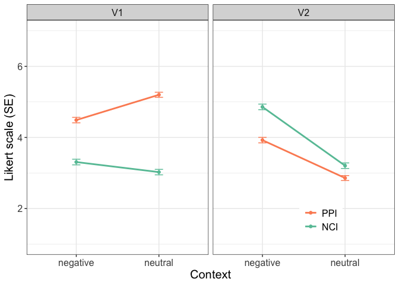
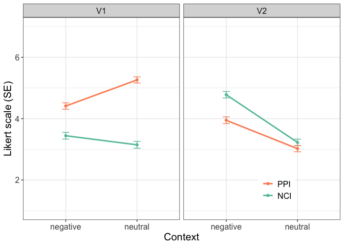
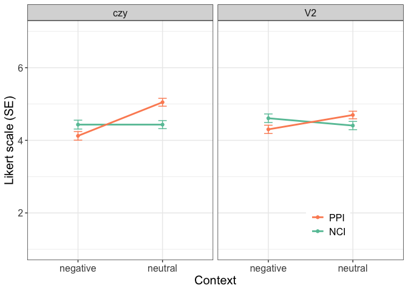
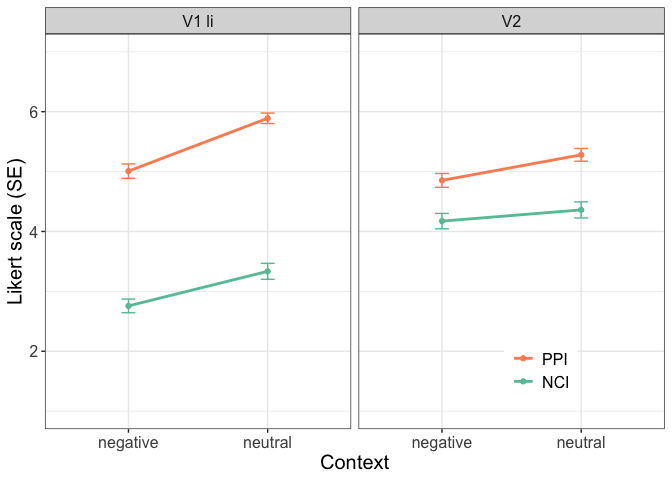
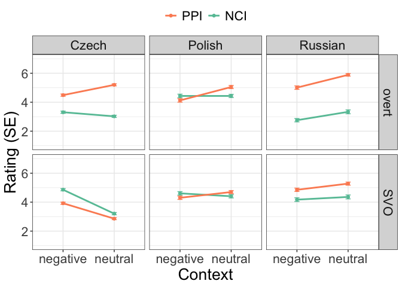

# Cz, Pol, Ru descriptive stat in one
Masha Onoeva

- [Loading languages](#loading-languages)
- [Cleaning unreliable](#cleaning-unreliable)
  - [Czech (from Anicka’s script)](#czech-from-anickas-script)
  - [Polish (from Mishi’s script)](#polish-from-mishis-script)
  - [Russian](#russian)
- [Descriptive for all langs](#descriptive-for-all-langs)
  - [Ru conditions](#ru-conditions)
  - [Cz conditions](#cz-conditions)
  - [Pol conditions](#pol-conditions)
- [Interaction plots](#interaction-plots)
  - [Czech](#czech)
  - [Polish](#polish)
  - [Russian](#russian-1)
- [All three in one](#all-three-in-one)

``` r
library(tidyverse) # THE package, it contains ggplot2, tidyr, dplyr, readr and more
```

## Loading languages

``` r
setwd("/Users/maria.onoeva/Desktop/new_folder/GitHub/stat-repo/freq")
library(readr)

ru <- read_delim("data/queslav_neg_mo_RESULTS_2023-03-06-0953_noaband.csv", ";",
                                             escape_double = FALSE,
                                             trim_ws = TRUE,
                                             show_col_types = FALSE)

cz <- read_delim("data/czequebi_RESULTS_2025-05-13-1548.csv", ";",
                                             escape_double = FALSE,
                                             trim_ws = TRUE,
                                             show_col_types = FALSE)

pol <- read_delim("data/no_abandoned_QueSlav_PL_RESULTS_2024-03-21-1341.csv", ";",
                                             escape_double = FALSE,
                                             trim_ws = TRUE,
                                             show_col_types = FALSE)
```

Removing trial from all three

``` r
cz_df <- cz %>%
  filter(is_test_trial == "no")

ru_df <- ru %>%
  filter(is_test_trial == "no")

pol_df <- pol %>%
  filter(is_test_trial == "no")
```

Checking participants and how many items they completed

``` r
langs_participants <- bind_rows(
  cz_df %>% count(participant, name = "items") %>% mutate(lang = "CZ"),
  ru_df %>% count(participant, name = "items") %>% mutate(lang = "RU"),
  pol_df %>% count(participant, name = "items") %>% mutate(lang = "POL")
)
```

## Cleaning unreliable

Now I need to remove all unreliable, I’ll do that as we did it in our
studies.

### Czech (from Anicka’s script)

``` r
#filtering unreliable participants (limit: 8 filler fillers correct) ----
#for F10 items 1-3: rating < 4
#for F10 items 4-10: rating > 4

cz_df_reliable <- cz_df %>%
    group_by(participant)%>%
    filter(participant != "9")%>%
    filter(participant != "35")%>%
    filter(participant != "51")%>%
    filter(participant != "72")%>%
    filter(participant != "127")%>%
    filter(participant != "8")%>%
    filter(participant != "40")%>%
    filter(participant != "42")%>%
    filter(participant != "86")%>%
    filter(participant != "123")

cz_df_reliable %>%
  ungroup() %>%
  summarise(total_part = n_distinct(participant)) # 129 as per Anicka's thesis
```

    # A tibble: 1 × 1
      total_part
           <int>
    1        129

### Polish (from Mishi’s script)

``` r
reliability <- subset(pol_df, pol_df$materials=="F5 - Reliability")

reliability$filler_answer <- 0
reliability$filler_answer <- as.numeric(reliability$filler_answer)

reliability$condition[reliability$item == "1"] <- 'bad'
reliability$condition[reliability$item == "2"] <- 'bad'
reliability$condition[reliability$item == "3"] <- 'bad'
reliability$condition[reliability$condition != "bad"] <- 'good'

reliability$filler_answer[which(grepl('bad', reliability$condition) &
grepl('[123]', reliability$rating1))] <- 1
reliability$filler_answer[which(grepl('good', reliability$condition) &
grepl('[567]', reliability$rating1))] <- 1

reliability_means <- reliability %>%
  group_by(participant) %>%
  dplyr::summarize(Mean = mean(filler_answer, na.rm=TRUE))

reliability_means <- subset(reliability_means, reliability_means$Mean >= 0.8)
reliability1 <- subset(reliability, reliability$participant %in% reliability_means$participant)

pl_accept1 <- subset(pol_df, pol_df$participant %in%
reliability1$participant)

pol_df_reliable <- pl_accept1

pol_df_reliable %>%
  summarise(total_part = n_distinct(participant)) # 67 as per Mishi's thesis
```

    # A tibble: 1 × 1
      total_part
           <int>
    1         67

### Russian

``` r
# creating a new df with the filler items only 
fillers_only <- ru_df %>%
  filter(materials == "f9_filler")

# creating a new column for checking if fillers are good or not 
fillers_only$filler_answer <- 0 
fillers_only$filler_answer <- as.numeric(fillers_only$filler_answer)

# rename filler items: the first three items were bad, the rest were good
fillers_only$condition[fillers_only$item %in% c("1", "2", "3")] <- 'bad'
fillers_only$condition[fillers_only$condition != "bad"] <- 'good'

# bad fillers
fillers_only$filler_answer[which(grepl('bad', fillers_only$condition) &
                                grepl('1|2|3', fillers_only$rating1))] <- 1

# good fillers 
fillers_only$filler_answer[which(grepl('good', fillers_only$condition) &
                                grepl('5|6|7', fillers_only$rating1))] <- 1

filler_results <- fillers_only %>% 
  group_by(participant) %>%
  summarize(Mean = mean(filler_answer, na.rm=TRUE))

# filler_results

# how in general the participants went through fillers 
# mean(filler_results$Mean)

unreliable_participants <- filler_results %>% 
  filter(Mean < 0.8) # I have 27 unreliable participants

fillers_only_reliable <- anti_join(filler_results, unreliable_participants, 
                          by = "participant")

# testing by applying mean to the reliable df
# mean(fillers_only_reliable$Mean)

ru_df_reliable <- anti_join(ru_df, unreliable_participants, 
                          by = "participant")

ru_df_reliable %>%
  distinct(participant) %>%
  summarize(total_part = n()) # 68 as per my results
```

    # A tibble: 1 × 1
      total_part
           <int>
    1         68

## Descriptive for all langs

Exporting E1 from each

``` r
cz_df_e1 <- cz_df_reliable %>%
  filter(materials == "qb_E1_main") 

pol_df_e1 <- pol_df_reliable %>%
  filter(materials == "E1") 

ru_df_e1 <- ru_df_reliable %>%
  filter(materials == "e1_main") 

bind_rows( # how many items each participant made for sanity check 
  cz_df_e1 %>% count(participant, name = "items") %>% mutate(lang = "CZ"),
  pol_df_e1 %>% count(participant, name = "items") %>% mutate(lang = "POL"),
  ru_df_e1 %>% count(participant, name = "items") %>% mutate(lang = "RU") )
```

    # A tibble: 264 × 3
    # Groups:   participant [137]
       participant items lang 
             <dbl> <int> <chr>
     1           1    32 CZ   
     2           2    32 CZ   
     3           3    32 CZ   
     4           4    32 CZ   
     5           5    32 CZ   
     6           6    32 CZ   
     7           7    32 CZ   
     8          10    32 CZ   
     9          11    32 CZ   
    10          12    32 CZ   
    # ℹ 254 more rows

Q: Should I address the fact that we have much more input from Cz?

``` r
bind_rows(
  cz_df_e1 %>% group_by(condition) %>% summarise(count=n()) %>% mutate(lang="CZ")
  %>% pivot_wider(names_from = condition, values_from = count, values_fill = 0),
  
  pol_df_e1 %>% group_by(condition) %>% summarise(count=n()) %>% mutate(lang="POL")
  %>% pivot_wider(names_from = condition, values_from = count, values_fill = 0),
  
  ru_df_e1 %>% group_by(condition) %>% summarise(count=n()) %>% mutate(lang="RU")
  %>% pivot_wider(names_from = condition, values_from = count, values_fill = 0)
  )
```

    # A tibble: 3 × 9
      lang      a     b     c     d     e     f     g     h
      <chr> <int> <int> <int> <int> <int> <int> <int> <int>
    1 CZ      516   516   516   516   516   516   516   516
    2 POL     268   268   268   268   268   268   268   268
    3 RU      272   272   272   272   272   272   272   272

### Ru conditions

``` r
# creating a new column for the first variable 'verb' and recoding 
# to the readable form 4 conditions were V1 li, 4 -- V2 
ru_df_e1$verb <- 0 
ru_df_e1$verb[ru_df_e1$condition %in% c("a", "c", "e", "g")] <- "V1 li"
ru_df_e1$verb[ru_df_e1$verb != "V1 li"] <- "V2"

# the same as above for the second variable 'context'
ru_df_e1$context <- 0 
ru_df_e1$context[ru_df_e1$condition %in% c("a", "b", "c", "d")] <- "neutral"
ru_df_e1$context[ru_df_e1$context != "neutral"] <- "negative"

# the same as above for the third variable 'indefinite'
ru_df_e1$indef <- 0 
ru_df_e1$indef[ru_df_e1$condition %in% c("a", "b", "e", "f")] <- "NCI"
ru_df_e1$indef[ru_df_e1$indef != "NCI"] <- "PPI"

ru_df_e1 <- ru_df_e1 %>%
  mutate(strategy = if_else(verb != "V2", "overt", "SVO"))
```

### Cz conditions

``` r
# creating a new column for the first variable 'verb' and recoding 
# to the readable form 4 conditions were V1 li, 4 -- V2 
cz_df_e1$verb <- 0 
cz_df_e1$verb[cz_df_e1$condition %in% c("a", "b", "c", "d")] <- "V1"
cz_df_e1$verb[cz_df_e1$verb != "V1"] <- "V2"

# the same as above for the second variable 'context'
cz_df_e1$context <- 0 
cz_df_e1$context[cz_df_e1$condition %in% c("b", "d", "f", "h")] <- "neutral"
cz_df_e1$context[cz_df_e1$context != "neutral"] <- "negative"

# the same as above for the third variable 'indefinite'
cz_df_e1$indef <- 0 
cz_df_e1$indef[cz_df_e1$condition %in% c("a", "b", "e", "f")] <- "NCI"
cz_df_e1$indef[cz_df_e1$indef != "NCI"] <- "PPI"

cz_df_e1 <- cz_df_e1 %>%
  mutate(strategy = if_else(verb != "V2", "overt", "SVO"))
```

### Pol conditions

``` r
# creating a new column for the first variable 'verb' and recoding 
# to the readable form 4 conditions were V1 li, 4 -- V2 
pol_df_e1$verb <- 0 
pol_df_e1$verb[pol_df_e1$condition %in% c("a", "b", "e", "f")] <- "czy"
pol_df_e1$verb[pol_df_e1$verb != "czy"] <- "V2"

# the same as above for the second variable 'context'
pol_df_e1$context <- 0 
pol_df_e1$context[pol_df_e1$condition %in% c("a", "b", "c", "d")] <- "negative"
pol_df_e1$context[pol_df_e1$context != "negative"] <- "neutral"

# the same as above for the third variable 'indefinite'
pol_df_e1$indef <- 0 
pol_df_e1$indef[pol_df_e1$condition %in% c("a", "c", "e", "g")] <- "NCI"
pol_df_e1$indef[pol_df_e1$indef != "NCI"] <- "PPI"

pol_df_e1 <- pol_df_e1 %>%
  mutate(strategy = if_else(verb != "V2", "overt", "SVO"))
```

``` r
cz_raw_summary <- cz_df_e1 %>%
  dplyr::group_by(condition, context, verb, indef, strategy) %>%
  dplyr::summarize(Median = median(rating1),
            Mean = mean(rating1),
            SD = sd(rating1), # sd = sqrt(var(rating1))
            )

cz_raw_summary
```

    # A tibble: 8 × 8
    # Groups:   condition, context, verb, indef [8]
      condition context  verb  indef strategy Median  Mean    SD
      <chr>     <chr>    <chr> <chr> <chr>     <dbl> <dbl> <dbl>
    1 a         negative V1    NCI   overt         3  3.31  1.80
    2 b         neutral  V1    NCI   overt         3  3.03  1.75
    3 c         negative V1    PPI   overt         5  4.49  1.76
    4 d         neutral  V1    PPI   overt         6  5.20  1.61
    5 e         negative V2    NCI   SVO           5  4.86  1.78
    6 f         neutral  V2    NCI   SVO           3  3.21  1.76
    7 g         negative V2    PPI   SVO           4  3.92  1.74
    8 h         neutral  V2    PPI   SVO           3  2.86  1.57

``` r
pol_raw_summary <- pol_df_e1 %>%
  dplyr::group_by(condition, context, verb, indef, strategy) %>%
  dplyr::summarize(Median = median(rating1),
            Mean = mean(rating1),
            SD = sd(rating1), # sd = sqrt(var(rating1))
            )

pol_raw_summary
```

    # A tibble: 8 × 8
    # Groups:   condition, context, verb, indef [8]
      condition context  verb  indef strategy Median  Mean    SD
      <chr>     <chr>    <chr> <chr> <chr>     <dbl> <dbl> <dbl>
    1 a         negative czy   NCI   overt         5  4.43  2.00
    2 b         negative czy   PPI   overt         5  4.12  1.94
    3 c         negative V2    NCI   SVO           5  4.61  1.93
    4 d         negative V2    PPI   SVO           5  4.30  1.87
    5 e         neutral  czy   NCI   overt         5  4.43  1.81
    6 f         neutral  czy   PPI   overt         6  5.05  1.77
    7 g         neutral  V2    NCI   SVO           5  4.41  1.86
    8 h         neutral  V2    PPI   SVO           5  4.70  1.71

``` r
ru_raw_summary <- ru_df_e1 %>%
  dplyr::group_by(condition, context, verb, indef, strategy) %>%
  dplyr::summarize(Median = median(rating1),
            Mean = mean(rating1),
            SD = sd(rating1), # sd = sqrt(var(rating1))
            )
ru_raw_summary <- ru_raw_summary %>%
  mutate(strategy = if_else(verb != "V2", "overt", "SVO"))

ru_raw_summary
```

    # A tibble: 8 × 8
    # Groups:   condition, context, verb, indef [8]
      condition context  verb  indef strategy Median  Mean    SD
      <chr>     <chr>    <chr> <chr> <chr>     <dbl> <dbl> <dbl>
    1 a         neutral  V1 li NCI   overt         3  3.33  2.20
    2 b         neutral  V2    NCI   SVO           5  4.36  2.22
    3 c         neutral  V1 li PPI   overt         6  5.89  1.45
    4 d         neutral  V2    PPI   SVO           6  5.28  1.75
    5 e         negative V1 li NCI   overt         2  2.76  1.89
    6 f         negative V2    NCI   SVO           4  4.17  2.12
    7 g         negative V1 li PPI   overt         6  5.01  1.98
    8 h         negative V2    PPI   SVO           5  4.85  1.91

## Interaction plots

### Czech

``` r
# This code is based on Radek Šimík's code.

library(Rmisc) # for summarySE, needed just here

# changing rating1 to numeric 
cz_df_e1$rating1 <- as.numeric(cz_df_e1$rating1)

# calculating interactions 
cz_tab_inter <- summarySE(cz_df_e1, measurevar="rating1", 
                         groupvars = c("context", "verb", "indef", "strategy"))


# plotting 
cz_plot <- ggplot(cz_tab_inter, aes(x=context, y=rating1, 
                                    colour=indef, group=indef)) + 
    geom_errorbar(aes(ymin=rating1-se, ymax=rating1+se), width=.1) +
    facet_wrap(~verb) +
    theme_bw() +
    geom_line(size = 1) +
    theme(
        text = element_text(size = 15),
        # legend.text = element_text(size=30),
        # legend.key.size = unit(1, 'cm'),
        legend.position = c(0.8, 0.15),
        legend.title=element_blank())+
        # axis.text = element_text(size = 25),
        # axis.title = element_text(size = 25),
# axis.title.y = element_text(margin = margin(t = 0, r = 20, b = 0, l = 0)),
# axis.title.x = element_text(margin = margin(t = 20, r = 0, b = 0, l = 0))) +
    geom_point() + 
    xlab("Context") +
    ylab("Likert scale (SE)") +
    coord_cartesian(ylim = c(1, 7)) +
    #scale_y_continuous(breaks = pretty_breaks(4)) +
    guides(colour = guide_legend(reverse=TRUE))  +
    scale_color_brewer(palette = "Set2")

cz_plot
```



I am a bit concerned about the number of Cz participants, so I want
randomly select 70 people just to test.

``` r
set.seed(123)  # for reproducibility
sampled_participants <- sample(unique(cz_df_e1$participant), 70)

cz_df_e1_70 <- cz_df_e1 %>%
  filter(participant %in% sampled_participants)

# changing rating1 to numeric 
cz_df_e1_70$rating1 <- as.numeric(cz_df_e1_70$rating1)

# calculating interactions 
cz_tab_inter_70 <- summarySE(cz_df_e1_70, measurevar="rating1", 
                         groupvars = c("context", "verb", "indef", "strategy"))

# plotting 
cz_plot_70 <- ggplot(cz_tab_inter_70, aes(x=context, y=rating1, 
                                    colour=indef, group=indef)) + 
    geom_errorbar(aes(ymin=rating1-se, ymax=rating1+se), width=.1) +
    facet_wrap(~verb) +
    theme_bw() +
    geom_line(size = 1) +
    theme(
        text = element_text(size = 15),
        # legend.text = element_text(size=30),
        # legend.key.size = unit(1, 'cm'),
        legend.position = c(0.8, 0.15),
        legend.title=element_blank())+
        # axis.text = element_text(size = 25),
        # axis.title = element_text(size = 25),
# axis.title.y = element_text(margin = margin(t = 0, r = 20, b = 0, l = 0)),
# axis.title.x = element_text(margin = margin(t = 20, r = 0, b = 0, l = 0))) +
    geom_point() + 
    xlab("Context") +
    ylab("Likert scale (SE)") +
    coord_cartesian(ylim = c(1, 7)) +
    #scale_y_continuous(breaks = pretty_breaks(4)) +
    guides(colour = guide_legend(reverse=TRUE))  +
    scale_color_brewer(palette = "Set2")

cz_plot_70
```



### Polish

``` r
# changing rating1 to numeric 
pol_df_e1$rating1 <- as.numeric(pol_df_e1$rating1)

# calculating interactions 
pol_tab_inter <- summarySE(pol_df_e1, measurevar="rating1", 
                         groupvars = c("context", "verb", "indef", "strategy"))

# plotting 
pol_plot <- ggplot(pol_tab_inter, aes(x=context, y=rating1, 
                                    colour=indef, group=indef)) + 
    geom_errorbar(aes(ymin=rating1-se, ymax=rating1+se), width=.1) +
    facet_wrap(~verb) +
    theme_bw() +
    geom_line(size = 1) +
    theme(
        text = element_text(size = 15),
        # legend.text = element_text(size=30),
        # legend.key.size = unit(1, 'cm'),
        legend.position = c(0.8, 0.15),
        legend.title=element_blank())+
        # axis.text = element_text(size = 25),
        # axis.title = element_text(size = 25),
# axis.title.y = element_text(margin = margin(t = 0, r = 20, b = 0, l = 0)),
# axis.title.x = element_text(margin = margin(t = 20, r = 0, b = 0, l = 0))) +
    geom_point() + 
    xlab("Context") +
    ylab("Likert scale (SE)") +
    coord_cartesian(ylim = c(1, 7)) +
    #scale_y_continuous(breaks = pretty_breaks(4)) +
    guides(colour = guide_legend(reverse=TRUE))  +
    scale_color_brewer(palette = "Set2")

pol_plot
```



### Russian

``` r
# changing rating1 to numeric 
ru_df_e1$rating1 <- as.numeric(ru_df_e1$rating1)

# calculating interactions 
ru_tab_inter <- summarySE(ru_df_e1, measurevar="rating1", 
                         groupvars = c("context", "verb", "indef", "strategy"))

# plotting 
ru_plot <- ggplot(ru_tab_inter, aes(x=context, y=rating1, 
                                    colour=indef, group=indef)) + 
    geom_errorbar(aes(ymin=rating1-se, ymax=rating1+se), width=.1) +
    facet_wrap(~verb) +
    theme_bw() +
    geom_line(size = 1) +
    theme(
        text = element_text(size = 15),
        # legend.text = element_text(size=30),
        # legend.key.size = unit(1, 'cm'),
        legend.position = c(0.8, 0.15),
        legend.title=element_blank())+
        # axis.text = element_text(size = 25),
        # axis.title = element_text(size = 25),
# axis.title.y = element_text(margin = margin(t = 0, r = 20, b = 0, l = 0)),
# axis.title.x = element_text(margin = margin(t = 20, r = 0, b = 0, l = 0))) +
    geom_point() + 
    xlab("Context") +
    ylab("Likert scale (SE)") +
    coord_cartesian(ylim = c(1, 7)) +
    #scale_y_continuous(breaks = pretty_breaks(4)) +
    guides(colour = guide_legend(reverse=TRUE))  +
    scale_color_brewer(palette = "Set2")

ru_plot
```



## All three in one

``` r
all_tab_inter <- bind_rows(
  cz_tab_inter %>% mutate(lang = "Czech"), 
  pol_tab_inter %>% mutate(lang = "Polish"), 
  ru_tab_inter %>% mutate(lang = "Russian")
)
all_tab_inter
```

        context  verb indef strategy   N rating1   sd     se    ci    lang
    1  negative    V1   NCI    overt 516    3.31 1.80 0.0790 0.155   Czech
    2  negative    V1   PPI    overt 516    4.49 1.76 0.0773 0.152   Czech
    3  negative    V2   NCI      SVO 516    4.86 1.78 0.0783 0.154   Czech
    4  negative    V2   PPI      SVO 516    3.92 1.74 0.0767 0.151   Czech
    5   neutral    V1   NCI    overt 516    3.03 1.75 0.0771 0.151   Czech
    6   neutral    V1   PPI    overt 516    5.20 1.61 0.0709 0.139   Czech
    7   neutral    V2   NCI      SVO 516    3.21 1.76 0.0777 0.153   Czech
    8   neutral    V2   PPI      SVO 516    2.86 1.57 0.0689 0.135   Czech
    9  negative   czy   NCI    overt 268    4.43 2.00 0.1220 0.240  Polish
    10 negative   czy   PPI    overt 268    4.12 1.94 0.1184 0.233  Polish
    11 negative    V2   NCI      SVO 268    4.61 1.93 0.1180 0.232  Polish
    12 negative    V2   PPI      SVO 268    4.30 1.87 0.1144 0.225  Polish
    13  neutral   czy   NCI    overt 268    4.43 1.81 0.1108 0.218  Polish
    14  neutral   czy   PPI    overt 268    5.05 1.77 0.1081 0.213  Polish
    15  neutral    V2   NCI      SVO 268    4.41 1.86 0.1137 0.224  Polish
    16  neutral    V2   PPI      SVO 268    4.70 1.71 0.1044 0.206  Polish
    17 negative V1 li   NCI    overt 272    2.76 1.89 0.1144 0.225 Russian
    18 negative V1 li   PPI    overt 272    5.01 1.98 0.1198 0.236 Russian
    19 negative    V2   NCI      SVO 272    4.17 2.12 0.1283 0.253 Russian
    20 negative    V2   PPI      SVO 272    4.85 1.91 0.1158 0.228 Russian
    21  neutral V1 li   NCI    overt 272    3.33 2.20 0.1335 0.263 Russian
    22  neutral V1 li   PPI    overt 272    5.89 1.45 0.0878 0.173 Russian
    23  neutral    V2   NCI      SVO 272    4.36 2.22 0.1346 0.265 Russian
    24  neutral    V2   PPI      SVO 272    5.28 1.75 0.1063 0.209 Russian

``` r
all_plot <- ggplot(all_tab_inter, aes(x=context, y=rating1, 
                                    colour=indef, group=indef)) + 
    geom_errorbar(aes(ymin=rating1-se, ymax=rating1+se), width=.1) +
    facet_grid(strategy~lang) +
    theme_bw() +
    geom_line(size = 1) +
    theme(
        text = element_text(size = 20),
        # legend.text = element_text(size=30),
        # legend.key.size = unit(1, 'cm'),
        # legend.position = c(0.8, 0.15),
        legend.position = "top", 
        legend.title=element_blank())+
        # axis.text = element_text(size = 25),
        # axis.title = element_text(size = 25),
# axis.title.y = element_text(margin = margin(t = 0, r = 20, b = 0, l = 0)),
# axis.title.x = element_text(margin = margin(t = 20, r = 0, b = 0, l = 0))) +
    geom_point() + 
    xlab("Context") +
    ylab("Rating (SE)") +
    coord_cartesian(ylim = c(1, 7)) +
    #scale_y_continuous(breaks = pretty_breaks(4)) +
    guides(colour = guide_legend(reverse=TRUE))  +
    scale_color_brewer(palette = "Set2")

all_plot
```



``` r
# as pdf 
ggsave(all_plot, file="all_plot.pdf", 
       width = 20, height = 20, units = "cm", device="pdf")
```
