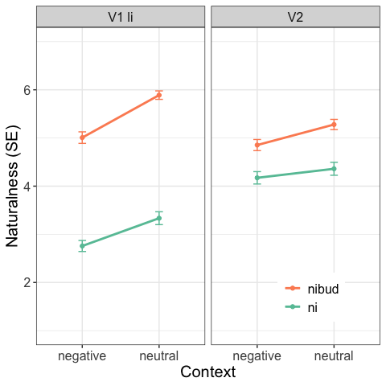

# R Notebook for naturalness/acceptability judgment experiments
Masha Onoeva

- [Info](#info)
- [Loading and cleaning data](#loading-and-cleaning-data)
  - [Fillers and unreliable
    participants](#fillers-and-unreliable-participants)
  - [Data sets](#data-sets)
- [Descriptive stat](#descriptive-stat)
  - [Table](#table)
  - [Stacked bar plot](#stacked-bar-plot)
  - [Interaction plot](#interaction-plot)
- [Inferential stat](#inferential-stat)
  - [Standard error](#standard-error)
  - [t-test](#t-test)
  - [ANOVA](#anova)
  - [Cumulative Link Mixed Model](#cumulative-link-mixed-model)

## Info

Hi! This R notebook describes the steps that are required for the
analysis of naturalness/acceptability judgment linguistic experiments. I
use the experiment that I did with Radek Šimík testing Russian negated
polar questions in different contexts as the example data (see [Onoeva
and Šimík
2023](https://mariaonoeva.github.io/assets/pdf/FDSL16_RuNPQs_Onoeva_Simik.pdf)).
We had several sub-experiments, here I report on one because code is the
same for all of them. The experiment was run on
[LRex](https://www.l-rex.de/).

#### Design

The goal of the experiment was to find out how natural are various
negated polar questions in different contexts. There were three
independent variables, each had two manipulations, so the design was 2 x
2 x 2. There variables were:

1.  verb: V1 li and V2
2.  indefinite: ni and nibud
3.  context: neutral and negative

Participants had to assess questions in different context on the scale
from 1 very unnatural to 7 very natural. It was the dependent variable.

Within-items, between subjects?

#### Files

The csv file with raw results is available in this repo (perhaps I can
also load a spreadsheet with all conditions that I used for LRex?).
There are also two files with the script – qmd and md. The first one is
a Quarto RMarkdown script from RStudio, the second one is a pretty
version for GitHub (it is easier to follow online).

## Loading and cleaning data

``` r
library(tidyverse) # THE package, it contains ggplot2, tidyr, dplyr, readr etc.
library(gt) # for pretty markdown tables, needed for notebook rendering 
```

There is an option to download a version without abandoned trials from
LRex and I load it here. Then I’m setting the working directory and
loading data. I have two ways here:

- standard local set up

``` r
# standard way of setting the directory locally on your machine
setwd("/Users/maria.onoeva/Desktop/new_folder/GitHub/stat-repo/freq")

# loading all data
all_df <-
  read_delim("data/queslav_neg_mo_RESULTS_2023-03-06-0953_noaband.csv", ";",
                                             escape_double = FALSE,
                                             trim_ws = TRUE,
                                             show_col_types = FALSE)
```

- this one is more convenient for sharing online and with someone

``` r
library(here) # sets the dir
# since I load it online, it's more convenient to do it via "here" package
# loading all data
all_df <-
  read_delim(here("data", # showing path to the folder with the file
                  "queslav_neg_mo_RESULTS_2023-03-06-0953_noaband.csv"), ";",
                                             escape_double = FALSE,
                                             trim_ws = TRUE,
                                             show_col_types = FALSE)
# I thank Masha Razguliaeva for the tip!
```

Then I remove the unnecessary example items.

``` r
# removing example items
main_df <- all_df %>%
  filter(materials != "1_examples")
```

### Fillers and unreliable participants

You can see the number of participants on LRex but just to double-check
it I’ll run a couple of lines here as well.

``` r
# counts all participants 
main_df %>%
  summarise(total_part = n_distinct(participant))
```

    # A tibble: 1 × 1
      total_part
           <int>
    1         95

``` r
# summarizes items for all participants 
main_df %>%
  count(participant, name = "items")
```

    # A tibble: 95 × 2
       participant items
             <dbl> <int>
     1           1    82
     2           2    82
     3           3    82
     4           4    82
     5           5    82
     6           6    82
     7           7    82
     8           8    82
     9           9    82
    10          10    82
    # ℹ 85 more rows

The next step is to extract all filler items. These items are used to
test reliability of the participants. Here I have 10 such items, people
had to assess 3 items as ‘bad’ or 1-4 and the rest as ‘good’ 5-7.

``` r
# creating a new df with the filler items only 
fillers_only <- main_df %>%
  filter(materials == "f9_filler")

# creating a new column for checking if fillers are good or not 
fillers_only$filler_answer <- 0 
fillers_only$filler_answer <- as.numeric(fillers_only$filler_answer)

# rename filler items: the first three items were bad, the rest were good
fillers_only$condition[fillers_only$item %in% c("1", "2", "3")] <- 'bad'
fillers_only$condition[fillers_only$condition != "bad"] <- 'good'
```

Now I’m assigning ‘1’ to filler_answer column if these filler items were
assessed correctly. In other words, if bad fillers have 1-4 and good
5-7. If these conditions are not met, the value remains ‘0’.

``` r
# bad fillers
fillers_only$filler_answer[which(grepl('bad', fillers_only$condition) &
                                grepl('1|2|3', fillers_only$rating1))] <- 1

# good fillers 
fillers_only$filler_answer[which(grepl('good', fillers_only$condition) &
                                grepl('5|6|7', fillers_only$rating1))] <- 1
```

So now I have the column which tells me how each participant assessed
each filler item. I can measure their reliability simply by counting how
good they were in the fillers. In the table below, the first participant
has mean ‘1’, so they have assessed all fillers correctly as I expected
them. If mean is lower than 80 %, a participant is unreliable.

``` r
filler_results <- fillers_only %>% 
  group_by(participant) %>%
  summarize(Mean = mean(filler_answer, na.rm=TRUE))

filler_results
```

    # A tibble: 95 × 2
       participant  Mean
             <dbl> <dbl>
     1           1   1  
     2           2   0.9
     3           3   0.8
     4           4   0.6
     5           5   0.6
     6           6   0.6
     7           7   0.9
     8           8   0.7
     9           9   0.9
    10          10   0.9
    # ℹ 85 more rows

``` r
# how in general the participants went through fillers 
mean(filler_results$Mean)
```

    [1] 0.844

Now I need to find unreliable participants. This is done quickly, just
to find the people who have means lower than 0.8. This is quite a high
threshold but 68 participants is still fine.

``` r
unreliable_participants <- filler_results %>% 
  filter(Mean < 0.8) # I have 27 unreliable participants
```

Then I remove unreliable participants from reliable ones.

``` r
fillers_only_reliable <- anti_join(filler_results, unreliable_participants, 
                          by = "participant")

# testing by applying mean to the reliable df
mean(fillers_only_reliable$Mean)
```

    [1] 0.924

### Data sets

In this experiment, we had one big experiment and several smaller, see
summary of the materials column.

``` r
main_df %>%
  group_by(materials) %>%
  summarise()
```

    # A tibble: 10 × 1
       materials      
       <chr>          
     1 e1_main        
     2 f1_nibud       
     3 f2_razve_pos   
     4 f3_razve_neg   
     5 f4_slucajno_neg
     6 f5_slucajno_pos
     7 f6_ctoli_neg   
     8 f7_ctoli_pos   
     9 f8_repetitive  
    10 f9_filler      

I’m going to separate them into several data frames. But first, it’s
necessary to remove the filler items and unreliable participants.

``` r
main_df1 <- main_df %>%
  filter(materials != "f9_filler")

main_df1 %>% 
  group_by(materials) %>%
  summarise() # no filler in the summary 
```

    # A tibble: 9 × 1
      materials      
      <chr>          
    1 e1_main        
    2 f1_nibud       
    3 f2_razve_pos   
    4 f3_razve_neg   
    5 f4_slucajno_neg
    6 f5_slucajno_pos
    7 f6_ctoli_neg   
    8 f7_ctoli_pos   
    9 f8_repetitive  

Removing unreliable participants and checking the number.

``` r
main_df2 <- anti_join(main_df1, unreliable_participants, 
                          by = "participant")

main_df2 %>%
  distinct(participant) %>%
  summarize(total_part = n())
```

    # A tibble: 1 × 1
      total_part
           <int>
    1         68

Now I need to create a separate df for each materials set, they are
stored in split_main_df1. It can be done using filter() but I try here
group_split(). I can access each group later.

``` r
split_main_df1 <- main_df2 %>% group_split(materials)
```

## Descriptive stat

The design for this experiment was 2 x 2 x 2.

| verb  | context  | indefinite |
|-------|----------|------------|
| V1 li | neutral  | ni         |
| V2    | negative | nibud      |

The conditions were coded as letters in the spreadsheet for LRex, so
first, I assign new comprehensible conditions, so it’s easier to read
the results. Not sure if it can be done in a more sophisticated way
(ChatGPT says otherwise :unamused: :expressionless:).

``` r
# accessing the first experiment from the groups  
e1_df <- split_main_df1[[1]]

# creating a new column for the first variable 'verb' and recoding 
# to the readable form 4 conditions were V1 li, 4 -- V2 
e1_df$verb <- 0 
e1_df$verb[e1_df$condition %in% c("a", "c", "e", "g")] <- "V1 li"
e1_df$verb[e1_df$verb != "V1 li"] <- "V2"

# the same as above for the second variable 'context'
e1_df$context <- 0 
e1_df$context[e1_df$condition %in% c("a", "b", "c", "d")] <- "neutral"
e1_df$context[e1_df$context != "neutral"] <- "negative"

# the same as above for the third variable 'indefinite'
e1_df$indef <- 0 
e1_df$indef[e1_df$condition %in% c("a", "b", "e", "f")] <- "ni"
e1_df$indef[e1_df$indef != "ni"] <- "nibud"

# ChatGPT version: idk case_when function 
# e1_df <- e1_df %>%
#   mutate(
#     indef = case_when(
#       condition %in% c("a", "b", "e", "f") ~ "ni",
#       TRUE ~ "nibud"
#     )
#   )
```

### Table

There are two ways how to look at my data: check how they are similar
and how they are different. For the first, I need measures of central
tendency – mode, mean, median, for the second variability values –
range, variance, standard deviation.

``` r
# creating one GIGA condition
# not necessary though, group_by() works just fine, but I'll need it further
e1_df <- e1_df %>%
 mutate(condition1 = paste(condition, context, verb, indef))

library(DescTools) # for Mode() 
e1_df$rating1 <- as.numeric(e1_df$rating1)

raw_summary <- e1_df %>%
  dplyr::group_by(indef, verb, context) %>%
  dplyr::summarize(Mode = Mode(rating1),
            Median = median(rating1),
            Mean = mean(rating1),
            Range = paste(range(rating1), collapse = "-"),
            Variance = var(rating1),
            SD = sd(rating1), # sd = sqrt(var(rating1))
            )

as_raw_html(raw_summary %>% gt(groupname_col = 'indef', 
                               rowname_col = 'context') %>%
  cols_label(verb = 'Verb'))
```

<div id="brezyxocih" style="padding-left:0px;padding-right:0px;padding-top:10px;padding-bottom:10px;overflow-x:auto;overflow-y:auto;width:auto;height:auto;">
  &#10;  

|          | Verb  | Mode | Median | Mean | Range | Variance | SD   |
|:---------|:------|:-----|:-------|:-----|:------|:---------|:-----|
| ni       |       |      |        |      |       |          |      |
| negative | V1 li | 1    | 2      | 2.76 | 1-7   | 3.56     | 1.89 |
| neutral  | V1 li | 1    | 3      | 3.33 | 1-7   | 4.85     | 2.20 |
| negative | V2    | 7    | 4      | 4.17 | 1-7   | 4.48     | 2.12 |
| neutral  | V2    | 7    | 5      | 4.36 | 1-7   | 4.93     | 2.22 |
| nibud    |       |      |        |      |       |          |      |
| negative | V1 li | 7    | 6      | 5.01 | 1-7   | 3.90     | 1.98 |
| neutral  | V1 li | 7    | 6      | 5.89 | 1-7   | 2.10     | 1.45 |
| negative | V2    | 7    | 5      | 4.85 | 1-7   | 3.65     | 1.91 |
| neutral  | V2    | 7    | 6      | 5.28 | 1-7   | 3.07     | 1.75 |

</div>

- **Mode** is the most popular ~~dude~~ number in the set. It’s usually
  not a very useful value but here why not :grin:
- **Median** is a true central tendency value as it’s in the middle but
  it’s necessary to order the values first. It’s resilient to outliers
  which can be good and bad at the same time.
- **Mean** is also known as average. It’s like a parent who loves their
  kids equally, or ideal socialism, it shows the sum of all values
  divided by their number, so if everybody should get the same, they get
  mean.
- **Range** is min and max values, not super telling here but can be
  useful with different data.
- For **variance** mean is required. To calculate that one, each
  observed value has to be compared to the mean, then this difference
  must be squared (because it can be negative), after the sum of all of
  these squared differences should be divided by the number of observed
  values (I’m aware about n and n-1 stuff, but there is no space for
  that). So it’s average for squared differences from the mean. It’s
  possible to do from median, I guess, but here it’s calculated from
  mean.
- **Standard deviation (SD)** is the easiest, it’s a square root from
  variance. Since differences from the mean were squared in the previous
  step, one needs to ‘unsquare’ that result. Perhaps my SDs are too high
  in some cases but this is what I’m going to investigate in my
  dissertation (Masha Razguliaeva’s comment: for naturalness judgments
  SD might be higher than for grammaticality).

### Stacked bar plot

The table is cool but the next step is to plot the results. Before I do
that I need to refactor and relevel ratings, so they are displayed
properly (not upside-down).

``` r
# have to make as factor, otherwise error 
e1_df$rating1 <- as.factor(e1_df$rating1)

# re-leveling ratings (I have this code from Anička Staňková)
e1_df_relevel <- e1_df %>%
  mutate(rating1 = fct_relevel(rating1,"7","6","5","4","3","2","1")) 

# re-leveling verbs so they are showed differently in the plot
e1_df_relevel1 <- e1_df_relevel %>%
  mutate(verb = fct_relevel(verb,"V1 li", "V2"))
```

I have commented out some lines for the plot but they are mostly
cosmetics that change size of text, etc. These might be useful for
specific cases but here I don’t need them.

``` r
facet_labels <- c('V1 li' = "LiPQs", 
                     'V2' = "IntonPQs", 
                     'ni' = "NCIs", 
                     'nibud' = "nibud")

verb.labs <- c("LiPQs", "IntonPQs")
names(verb.labs) <- c("V1 li", "V2")
indef.labs <- c("NCIs", "nibud")
names(indef.labs) <- c("ni", "nibud")

facet_border <- data.frame(
  xmin = -Inf, xmax = Inf, ymin = -Inf, ymax = Inf, 
  verb = 'V1 li', indef = 'NCIs'
)


e1_main_plot1 <- ggplot(e1_df_relevel1, aes(fill = rating1, x = context)) + 
  geom_bar(position = "fill") +
  geom_hline(aes(yintercept = 0.5), size = 0.5) +
  facet_wrap(~verb + indef, labeller = labeller(verb = verb.labs, indef = indef.labs)) +
  theme_bw() +
  scale_fill_brewer(palette = "RdYlGn", direction = -1) +
  theme(
    legend.position = "right",
    text = element_text(size = 30),
    legend.text = element_text(size = 20),
    legend.key.size = unit(1, 'cm'),
    legend.title = element_blank()
    # axis.text = element_text(size = 25),
    # axis.title = element_text(size = 25),
    # axis.title.y = element_text(margin = margin(t = 0, r = 20, b = 0, l = 0)),
    # axis.title.x = element_text(margin = margin(t = 20, r = 0, b = 0, l = 0))
  ) +
  xlab("Context") +
  ylab("Proportions of rating") + 
  geom_rect(data = subset(e1_df_relevel1, verb  %in% c("V2") & indef %in% c("ni")), 
                          fill = NA, colour = "blue", size = 4,
                          xmin = -Inf,xmax = Inf,
                          ymin = -Inf, ymax = Inf) 
e1_main_plot1
```


``` r
ggsave(e1_main_plot1, file="e1_main11.pdf", 
       width = 25, height = 27, units = "cm", device="pdf")
```

On the x axis, there are contexts, on the y axis – proportions of
ratings. The darkness of the bars indicates naturalness (dark means more
natural). The black line that strikes through the plots is median.

It is also possible to save the plots using this code:

``` r
ggsave(e1_main_plot, file="e1_main1.eps", 
       width = 35, height = 37, units = "cm", device="eps")
ggsave(e1_main_plot, file="e1_main1_pdf.pdf", 
       width = 20, height = 20, units = "cm", device="pdf")
```

### Interaction plot

The next step is to create an interaction plot. First, I do the
calculations and then plot the results.

:exclamation: I use here the results **before re-leveling**.

``` r
# This code is based on Radek Šimík's code.

library(Rmisc) # for summarySE, needed just here

# I load the df to inter_df
inter_df <- e1_df

# changing rating1 to numeric 
inter_df$rating1 <- as.numeric(inter_df$rating1)

# calculating interactions 
tab_inter <- summarySE(inter_df, measurevar="rating1", 
                         groupvars = c("context", "verb", "indef"))
```

The plot code might look crazy, but I’ve commented things out and most
of the lines are cosmetics.

``` r
# plotting 
inter_plot <- ggplot(tab_inter, aes(x=context, y=rating1, 
                                    colour=indef, group=indef)) + 
    geom_errorbar(aes(ymin=rating1-se, ymax=rating1+se), width=.1) +
    facet_wrap(~verb) +
    theme_bw() +
    geom_line(size = 1) +
    theme(
        text = element_text(size = 15),
        # legend.text = element_text(size=30),
        # legend.key.size = unit(1, 'cm'),
        legend.title=element_blank())+
        # legend.position = c(0.8, 0.15),
        # axis.text = element_text(size = 25),
        # axis.title = element_text(size = 25),
# axis.title.y = element_text(margin = margin(t = 0, r = 20, b = 0, l = 0)),
# axis.title.x = element_text(margin = margin(t = 20, r = 0, b = 0, l = 0))) +
    geom_point() + 
    xlab("Context") +
    ylab("Naturalness (SE)") +
    coord_cartesian(ylim = c(1, 7)) +
    #scale_y_continuous(breaks = pretty_breaks(4)) +
    guides(colour = guide_legend(reverse=TRUE))  +
    scale_color_brewer(palette = "Set2")

inter_plot
```



The same plot as above but for each item. (Perhaps I can use conditions
as color?)

``` r
tab_inter_items <- summarySE(inter_df, measurevar="rating1", 
                         groupvars = c("item", "context", "verb", "indef"))

# plotting 
inter_plot_items <- ggplot(tab_inter_items, aes(x=item,y=rating1, 
                                                colour=indef, group=indef)) + 
    geom_errorbar(aes(ymin=rating1-se, ymax=rating1+se), width=.1) +
    #facet_wrap(~verb+context) +
    facet_grid(vars(verb),  rows = vars(context)) +
    theme_bw() +
    geom_line() +
    theme(
        text = element_text(size = 15),
        # legend.text = element_text(size=30),
        # legend.key.size = unit(1, 'cm'),
        legend.title=element_blank())+
        # legend.position = c(0.8, 0.15),
        # axis.text = element_text(size = 25),
        # axis.title = element_text(size = 25),
# axis.title.y = element_text(margin = margin(t = 0, r = 20, b = 0, l = 0)),
# axis.title.x = element_text(margin = margin(t = 20, r = 0, b = 0, l = 0))) +
    geom_point() + 
    xlab("Context") +
    ylab("Naturalness (SE)") +
    coord_cartesian(ylim = c(1, 7)) +
    #scale_y_continuous(breaks = pretty_breaks(4)) +
    guides(colour = guide_legend(reverse=TRUE))  +
    scale_color_brewer(palette = "Set2") +
    scale_x_continuous(breaks=seq(1, 32, by = 2))

inter_plot_items
```


## Inferential stat

The purpose of inferential statistics is to determine whether the
experimental results were not produced by chance. In other words, there
is a chance that our results are like this by a mere accident and the
interactions between the variables are just coincidences. But using some
smart tests one can eliminate this possibility. Inferential stat also
helps to clearly articulate interactions which are found in the sample.
Various models are used for this, so stay tuned.

I begin with the most basic basics and continue further.

### Standard error

Unlike SD, SE is an inferential statistic in this case, so it can only
be estimated. In the ideal case if one knows the population mean, SE can
be calculated. But there is no mean for all Russian speakers, so the
input values for SE are replaced with the sample mean and thus the
sample SD.

In the table below, there are means from the descriptive table together
with Standard Deviations (SD), Standard Errors (SE) and Relative SEs.
SEs were already present in the interaction plot, it’s represented as
those little bars around the dots. There is an option to plot SD but
those plots look crazy.

``` r
e1_df$rating1 <- as.numeric(e1_df$rating1)

# using dplyr:: here as the functions interfere with plyr
raw_summary1 <- e1_df %>%
  dplyr::group_by(indef, verb, context) %>% 
  dplyr::summarize(Mean = mean(rating1), 
            SD = sd(rating1), # sd = sqrt(var(rating1))
            SE = sd(rating1)/sqrt(length(rating1)),
            # RSD = sd(rating1)/mean(rating1) * 100,
            # Conf = mean(rating1)/sd(rating1),
            RSE = sd(rating1)/sqrt(length(rating1))/mean(rating1) * 100
            )

as_raw_html(raw_summary1 %>% gt(groupname_col = 'indef', 
                                rowname_col = 'context') %>%
  cols_label(verb = 'Verb',
             RSE = 'RSE (%)'))
```

<div id="ppbmvnuczs" style="padding-left:0px;padding-right:0px;padding-top:10px;padding-bottom:10px;overflow-x:auto;overflow-y:auto;width:auto;height:auto;">
  &#10;  

|          | Verb  | Mean | SD   | SE     | RSE (%) |
|:---------|:------|:-----|:-----|:-------|:--------|
| ni       |       |      |      |        |         |
| negative | V1 li | 2.76 | 1.89 | 0.1144 | 4.15    |
| neutral  | V1 li | 3.33 | 2.20 | 0.1335 | 4.00    |
| negative | V2    | 4.17 | 2.12 | 0.1283 | 3.07    |
| neutral  | V2    | 4.36 | 2.22 | 0.1346 | 3.09    |
| nibud    |       |      |      |        |         |
| negative | V1 li | 5.01 | 1.98 | 0.1198 | 2.39    |
| neutral  | V1 li | 5.89 | 1.45 | 0.0878 | 1.49    |
| negative | V2    | 4.85 | 1.91 | 0.1158 | 2.39    |
| neutral  | V2    | 5.28 | 1.75 | 0.1063 | 2.01    |

</div>

SE is supposed to tell how close my sample mean is to the population
mean. In other words, if I would do this experiment a couple more times,
new possible means could differ this SE much from each other. The
formula for SE is pretty easy, n is a number of observations,

$$SE = \frac{SD}{\sqrt{n}}$$

But is it too big or I’m fine? RSE indicates that. It represents the
size of SE relative to the mean, so as percentage. They say if RSE is
below 10 %, then SE is relatively small as they are here.

### t-test

Student’s t-test is unlikely the best test for this experiment but it’s
calculated from SE and mean, so why not to have it? :wink:

The formula for t-value is the following, looks complicated, meh.

$$
t = \frac{\bar{x} - \mu}{SE}
$$

But if one rewrites it, it becomes super clear:

$$
t \times SE = \bar{x} - \mu
$$

So t-value says how much my sample mean or x-bar is far from the
population mean or mu in SEs. If I need many SEs, the difference is big,
if little, the difference is not big.

Since I have only one sample and no population mean, I need to find mu
to compare it with, shall it be 0. So now there are two hypotheses:

1.  the sample mean = 0
2.  the sample mean is significantly different from 0

I’m going to use here a one sample t-test because I have one sample.
There are also paired samples t-test and independent samples t-test. For
the first, it’s required to measure one sample two times, for the
second, one needs at least two different samples, then their differences
are compared.

t-test can be run like this for one condition. The output says that it
is unlikely that the observed mean was due to chance as t = 25 and p \<
2e-16.

``` r
cond_1 <- e1_df %>% filter(condition1 == 'a neutral V1 li ni')
t.test(cond_1$rating1)
```


        One Sample t-test

    data:  cond_1$rating1
    t = 25, df = 271, p-value <2e-16
    alternative hypothesis: true mean is not equal to 0
    95 percent confidence interval:
     3.07 3.60
    sample estimates:
    mean of x 
         3.33 

Or it can be done for all 8 conditions at once. All t-values are huge,
up to t = 67 and ps \< 0.05.

``` r
library(broom)

# packing all conditions into a vector 
conditions <- e1_df %>%
  dplyr::distinct(condition1) %>%
  pull(condition1)

# applying t.test function to each condition and creating a table 
t_test_results <- map_df(conditions, function(cond) {
  result <- e1_df %>% 
    filter(condition1 == cond) %>% 
    pull(rating1) %>% 
    t.test() %>%
    tidy()
  
  result$Condition <- cond
  return(result)
})

as_raw_html(t_test_results %>% 
              gt() %>% 
              cols_move_to_start(columns = Condition) %>%
              cols_label(estimate = 'Mean',
                         statistic = 't-value', 
                         p.value = 'p-value'))
```

<div id="iitchtwgpd" style="padding-left:0px;padding-right:0px;padding-top:10px;padding-bottom:10px;overflow-x:auto;overflow-y:auto;width:auto;height:auto;">
  &#10;  

| Condition | Mean | t-value | p-value | parameter | conf.low | conf.high | method | alternative |
|:---|---:|---:|---:|---:|---:|---:|:---|:---|
| c neutral V1 li nibud | 5.89 | 67.1 | 9.12e-171 | 271 | 5.72 | 6.06 | One Sample t-test | two.sided |
| d neutral V2 nibud | 5.28 | 49.7 | 3.99e-138 | 271 | 5.07 | 5.49 | One Sample t-test | two.sided |
| e negative V1 li ni | 2.76 | 24.1 | 2.16e-69 | 271 | 2.53 | 2.98 | One Sample t-test | two.sided |
| f negative V2 ni | 4.17 | 32.5 | 1.43e-95 | 271 | 3.92 | 4.43 | One Sample t-test | two.sided |
| g negative V1 li nibud | 5.01 | 41.8 | 3.70e-120 | 271 | 4.77 | 5.24 | One Sample t-test | two.sided |
| h negative V2 nibud | 4.85 | 41.9 | 1.90e-120 | 271 | 4.62 | 5.08 | One Sample t-test | two.sided |
| a neutral V1 li ni | 3.33 | 25.0 | 3.10e-72 | 271 | 3.07 | 3.60 | One Sample t-test | two.sided |
| b neutral V2 ni | 4.36 | 32.4 | 3.31e-95 | 271 | 4.10 | 4.63 | One Sample t-test | two.sided |

</div>

#### Two-tailed and one-tailed?

It depends on predictions. If I predict that my difference will be
somehow direct towards positive or negative t, I use one-tailed test.
Two-tailed is used when one just looks for some difference and doesn’t
care about positive or negative direction. Two-tailed is more
conservative though which is good for the type I error exclusion. In
principle, here I assume that my results should be bigger than 0, so I
can use one-tailed test but I don’t really care that much, so whatevs.

#### What is p-value though?

It is the probability of seeing a test statistic, here it’s t-value, as
extreme or more extreme as one observes given the null hypothesis
([Vasishth and Nicenboim
2016](https://compass.onlinelibrary.wiley.com/doi/abs/10.1111/lnc3.12201)).
Complicated as heck. But if one writes it this way

$$
P(data|H_0)
$$

is it easier to understand? This is just conditional probability. If H0
is true, how likely the observed statistic is. Low p-value says that we
can reject H0, but it doesn’t say we accept H1 though, as it’s not in
condition.

#### Why isn’t t-test good for this experiment?

One of the reasons is that I have a factorial design, so there are
multiple conditions that have to be compared to each other. t-test
compares mean with 0. It says if the sample mean is significantly
different and if it is or isn’t obtained by chance. But I want to know
what influence manipulations have on the dependent variable. I can pair
conditions and run it but then it’s ANOVA which is the next test. And it
feels a bit wrong when I compare it with 0, maybe it’s more correct to
compare it with 1 ‘completely unacceptable’ or 7 ‘completely
acceptable’?

Another reason is that my sample data are not that independent as t-test
requires them to be. I have to account for variability in participants
and in items. There are possibilities how to account for it for t-test
(aggregate all) but it’s better to do a linear mixed model.

### ANOVA

#### One-way ANOVA

> [!NOTE]
>
> ### Disclaimer
>
> :point_up:: All of this with one-way ANOVA is done only for an
> explanatory and study purpose. My design is within-subject, so
> technically I cannot use one-way ANOVA. I violate so many things here
> :grimacing:
>
> :v:: All taken from [this
> web](https://statsandr.com/blog/anova-in-r/), [this
> web](https://support.minitab.com/en-us/minitab/help-and-how-to/statistical-modeling/anova/supporting-topics/basics/what-is-anova/)
> and Levshina (2016).

ANOVA (Analysis of Variance) suits a bit better for the experiment but
it’s still not quite there yet as it doesn’t care for random effects.
With t-test I compared two things only, now I can do it with all my
conditions. ANOVA determines whether the means I have in my conditions
are significantly different from each other. My hypotheses for ANOVA
are:

- H0: mean(a) = mean(b) = mean(c) = mean(d) = mean(e) = mean(f) =
  mean(g) = mean(e)

- H1: **at least one** of them is different

One of the requirements for this test is to have a continuous
quantitative dependent variable. I have a Lickert scale, it’s an ordinal
scale and those are considered categorical but let’s pretend that it’s
continuous. As for the independent variables, they have to be
qualitative with at least two levels.

Other requirements are normality and equality of variances. For the
first one, with this sample size distribution should not be necessary
normal, but the second requirement has to be checked. Levene’s test
suits for this which is run below. p-value is pretty small, so the null
hypothesis that the variances are equal is rejected. I need to consider
for that in the model and use Welch ANOVA.

``` r
e1_df$condition = as.factor(e1_df$condition)
car::leveneTest(rating1~condition, e1_df)
```

    Levene's Test for Homogeneity of Variance (center = median)
            Df F value Pr(>F)    
    group    7    14.8 <2e-16 ***
          2168                   
    ---
    Signif. codes:  0 '***' 0.001 '**' 0.01 '*' 0.05 '.' 0.1 ' ' 1

Welch ANOVA is present below.

``` r
oneway.test(rating1~condition, 
            data = e1_df, 
            var.equal = FALSE) # Welch ANOVA as variances aren't equal
```


        One-way analysis of means (not assuming equal variances)

    data:  rating1 and condition
    F = 90, num df = 7, denom df = 927, p-value <2e-16

Below is the most common output from ANOVA. Once again I violate perhaps
all conditions that can be violated but who cares. p-value is small, so
we reject H0 that all groups are equal.

``` r
e1_df$rating1 <- as.numeric(e1_df$rating1)
e1_df.aov <- aov(rating1~condition1, data=e1_df)
summary(e1_df.aov)
```

                  Df Sum Sq Mean Sq F value Pr(>F)    
    condition1     7   2020   288.6    75.6 <2e-16 ***
    Residuals   2168   8274     3.8                   
    ---
    Signif. codes:  0 '***' 0.001 '**' 0.01 '*' 0.05 '.' 0.1 ' ' 1

##### Df (degree of freedom)

- condition1: my 8 groups that I compare :arrow_right: 8 - 1 = 7

- Residuals: total observations - number of groups :arrow_right: 2176 -
  8 = 2168

##### Sum Sq (Sum of Squares)

**condition1:** between group variance – 2020 (Explained variance)

How to obtain this? Let’s count this manually.

``` r
# adding all means to one vector from the descriptive table above
all_means <- raw_summary1$Mean

# computing a grand mean, sum of all means in condition1 divided by their count 
overall_mean <- sum(all_means)/8 

# new vector, counting square differences: individual mean - grand mean
all_means_var <- (all_means-overall_mean)^2

# multiplying vector by total occurrence for each group, 272 inputs and sum 
sum2_condition <- sum(all_means_var*272) 

# voila, the same value!
sum2_condition
```

    [1] 2020

**Residuals**: within group variance – 8274 (Unexplained variance)
$$ SumSq_{Residulas} = SumSq_{Total} - SumSq_{Between}$$ SumSq Total:
how each value varied from the grand mean

``` r
# all obtained values from E1
all_rating <- e1_df$rating1

# how far was the value from the overall grand mean, squaring and summing all
sum2_total <- sum((all_rating-overall_mean)^2)
sum2_total
```

    [1] 10294

And SumSq Residuals:

``` r
sum2_res <- sum2_total - sum2_condition

# voila again! the same value from the ANOVA summary for residuals sumsq 
sum2_res
```

    [1] 8274

##### Mean Sq

- condition1 :arrow_right: SumSq / Df = 288.6

- Residuals :arrow_right: SumSq / Df = 3.8

``` r
print(mean2_condition <- sum2_condition/7)
```

    [1] 289

``` r
print(mean2_residuls <- sum2_res/2168)
```

    [1] 3.82

##### F-value

$$
F = \frac{explained \, variance}{unexplained\,variance} = 75.6
$$

or

$$
F = \frac{Mean2_{condition1}}{Mean2_{residuals}} = 75.6
$$

``` r
f_value <- mean2_condition/mean2_residuls
f_value # yay! this is the same!!!
```

    [1] 75.6

##### p-value

p-value is teeny-tiny, so given this data set, the probability of all
means being equal is this much:

``` r
p_value <- pf(f_value, 7, 2168, lower.tail = FALSE)
p_value
```

    [1] 2.82e-98

But it only means that at least one is different but which one? And what
is the relation between other variables?

#### Three-way ANOVA and lm()

Wait a sec, where is a two-way ANOVA? Well, since we moved to the
independent variables (finally!), ANOVA is three way now. Seems clear,
if there are two variables, then it’s two way ANOVA.

``` r
e1_df.aov3 <- aov(rating1~verb*indef*context, data = e1_df)
summary(e1_df.aov3)
```

                         Df Sum Sq Mean Sq F value  Pr(>F)    
    verb                  1     96      96   25.04 6.1e-07 ***
    indef                 1   1395    1395  365.43 < 2e-16 ***
    context               1    146     146   38.31 7.2e-10 ***
    verb:indef            1    349     349   91.57 < 2e-16 ***
    verb:context          1     24      24    6.37   0.012 *  
    indef:context         1     10      10    2.64   0.104    
    verb:indef:context    1      0       0    0.04   0.843    
    Residuals          2168   8274       4                    
    ---
    Signif. codes:  0 '***' 0.001 '**' 0.01 '*' 0.05 '.' 0.1 ' ' 1

In principle, it does all of the described steps above but for each
group. I’ll do it for verb here.

``` r
overall_mean <- mean(raw_summary1$Mean)

verb_V1 <- e1_df %>%
  filter(verb == "V1 li")

verb_V2 <- e1_df %>%
  filter(verb == "V2")

mean_V1 <- mean(verb_V1$rating1)
mean_V2 <- mean(verb_V2$rating1)

observ_verb <- 1088

sum2_verb <- observ_verb * (mean_V1-overall_mean)^2 + observ_verb * (mean_V2-overall_mean)^2
sum2_verb
```

    [1] 95.6

It works! So this model now tells me that all my three factors influence
the independent variable. There is also an interaction between verb and
indef and a weaker interaction of verb and context. It is not ideal but
it already deals with the independent variables. What it does it
compares these three groups and their means to the grand mean but it
doesn’t tell how much the independent variables affect the dependent
one.

So I’m going to try another trick here: instead of aov() I’ll use lm().
Results from the bottom of the summary might seem familiar. There are
degrees of freedom for residuals, F-statistic/value and p-value. So lm
estimates coefficients for factor levels whereas ANOVA compares means
between the groups.

``` r
e1_df$rating1 <- as.numeric(e1_df$rating1) # data need to be factorial
e1_df.lm <- lm(rating1~verb*indef*context, data=e1_df)
summary(e1_df.lm)
```


    Call:
    lm(formula = rating1 ~ verb * indef * context, data = e1_df)

    Residuals:
       Min     1Q Median     3Q    Max 
     -4.89  -1.76   0.11   1.67   4.24 

    Coefficients:
                                     Estimate Std. Error t value Pr(>|t|)    
    (Intercept)                        2.7574     0.1184   23.28  < 2e-16 ***
    verbV2                             1.4154     0.1675    8.45  < 2e-16 ***
    indefnibud                         2.2500     0.1675   13.43  < 2e-16 ***
    contextneutral                     0.5772     0.1675    3.45  0.00058 ***
    verbV2:indefnibud                 -1.5699     0.2369   -6.63  4.3e-11 ***
    verbV2:contextneutral             -0.3897     0.2369   -1.65  0.10011    
    indefnibud:contextneutral          0.3051     0.2369    1.29  0.19785    
    verbV2:indefnibud:contextneutral  -0.0662     0.3350   -0.20  0.84343    
    ---
    Signif. codes:  0 '***' 0.001 '**' 0.01 '*' 0.05 '.' 0.1 ' ' 1

    Residual standard error: 1.95 on 2168 degrees of freedom
    Multiple R-squared:  0.196, Adjusted R-squared:  0.194 
    F-statistic: 75.6 on 7 and 2168 DF,  p-value: <2e-16

``` r
e1_df$rating1 = as.factor(e1_df$rating1)
e1_df$condition1 = as.factor(e1_df$condition1)
e1_df$context = as.factor(e1_df$context)

scat_plot <- ggplot(e1_df, aes(x=context, y=rating1, fill=condition1, group=condition1)) +
  geom_boxplot() +  
  geom_jitter(width = 0.2, alpha = 0.4)+
  facet_wrap(~verb+indef) +
  scale_color_brewer(palette = "Set2")

scat_plot
```

``` r
library(ordinal)
e1_df$rating1 = as.factor(e1_df$rating1)
clm_model <- clm(rating1 ~ indef * verb * context, data = e1_df)
summary(clm_model)
```

    formula: rating1 ~ indef * verb * context
    data:    e1_df

     link  threshold nobs logLik   AIC     niter max.grad cond.H 
     logit flexible  2176 -3887.37 7800.74 5(0)  3.70e-13 6.8e+02

    Coefficients:
                                     Estimate Std. Error z value Pr(>|z|)    
    indefnibud                          1.952      0.157   12.46  < 2e-16 ***
    verbV2                              1.218      0.154    7.91  2.5e-15 ***
    contextneutral                      0.471      0.154    3.05   0.0023 ** 
    indefnibud:verbV2                  -1.385      0.216   -6.42  1.4e-10 ***
    indefnibud:contextneutral           0.319      0.218    1.46   0.1435    
    verbV2:contextneutral              -0.284      0.218   -1.31   0.1917    
    indefnibud:verbV2:contextneutral   -0.156      0.305   -0.51   0.6106    
    ---
    Signif. codes:  0 '***' 0.001 '**' 0.01 '*' 0.05 '.' 0.1 ' ' 1

    Threshold coefficients:
        Estimate Std. Error z value
    1|2   -0.496      0.112   -4.44
    2|3    0.246      0.111    2.22
    3|4    0.794      0.112    7.08
    4|5    1.312      0.115   11.45
    5|6    1.908      0.118   16.19
    6|7    2.714      0.123   22.10

Is that it? Is this the final model? No :smiling_imp:

Now we want to be sure that the effects we see are from the independent
variables but not from random participants variation or bad items. You
see, the items could have been very bad, e.g., there was one that
everyone disliked and that influenced the ratings. Or some participants
were somehow weird and assessed questions in a particular way. What I
need to know now, that is my results are reliable even if these factors
are included, so I need **a mixed model**.

### Cumulative Link Mixed Model

So far I looked whether my obtained means are different from each other.
I just found out that some conditions significantly more natural then
the others. But why? Well, maybe it’s a chance or maybe these three
independent variables that I had impacted their naturalness. Using
linear models one can now check how the independent variables change the
dependent one.

Just to remind:

- rating from 1 to 7 is my dependent variable, it is ordinal type of
  data (very important!)

- three variables each with two levels are independent

  - indef: ni/nibud

  - context: neutral/negative

  - verb: V1/V2

Maybe one of the independent variables affected the dependent, maybe
their combinations did.

I’ll come back with more :v: :sparkles:

``` r
library(modelsummary)
library(lmerTest)
library(gtsummary)
```

``` r
e1_df$rating1 = as.factor(e1_df$rating1)

clmm_model <- clmm(rating1 ~ verb * context * indef + 
  (1 | participant) + (1 | item), 
  contrasts = list(verb="contr.sum",
                   indef="contr.sum", 
                   context="contr.sum"), 
  data=e1_df)

summary(clmm_model)
```

    Cumulative Link Mixed Model fitted with the Laplace approximation

    formula: rating1 ~ verb * context * indef + (1 | participant) + (1 | item)
    data:    e1_df

     link  threshold nobs logLik   AIC     niter       max.grad cond.H 
     logit flexible  2176 -3681.28 7392.57 2729(10920) 4.90e-03 2.8e+02

    Random effects:
     Groups      Name        Variance Std.Dev.
     participant (Intercept) 0.940    0.970   
     item        (Intercept) 0.258    0.508   
    Number of groups:  participant 68,  item 32 

    Coefficients:
                          Estimate Std. Error z value Pr(>|z|)    
    verb1                  -0.1795     0.0397   -4.53  6.0e-06 ***
    context1               -0.2440     0.0401   -6.09  1.1e-09 ***
    indef1                 -0.8142     0.0423  -19.26  < 2e-16 ***
    verb1:context1         -0.1130     0.0396   -2.85   0.0043 ** 
    verb1:indef1           -0.4060     0.0404  -10.05  < 2e-16 ***
    context1:indef1         0.0674     0.0398    1.69   0.0905 .  
    verb1:context1:indef1   0.0215     0.0396    0.54   0.5872    
    ---
    Signif. codes:  0 '***' 0.001 '**' 0.01 '*' 0.05 '.' 0.1 ' ' 1

    Threshold coefficients:
        Estimate Std. Error z value
    1|2   -2.375      0.165  -14.37
    2|3   -1.529      0.160   -9.57
    3|4   -0.885      0.158   -5.62
    4|5   -0.266      0.157   -1.70
    5|6    0.458      0.157    2.93
    6|7    1.464      0.159    9.19
